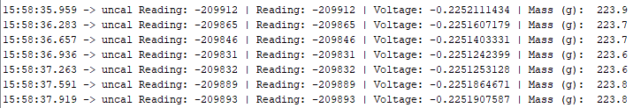
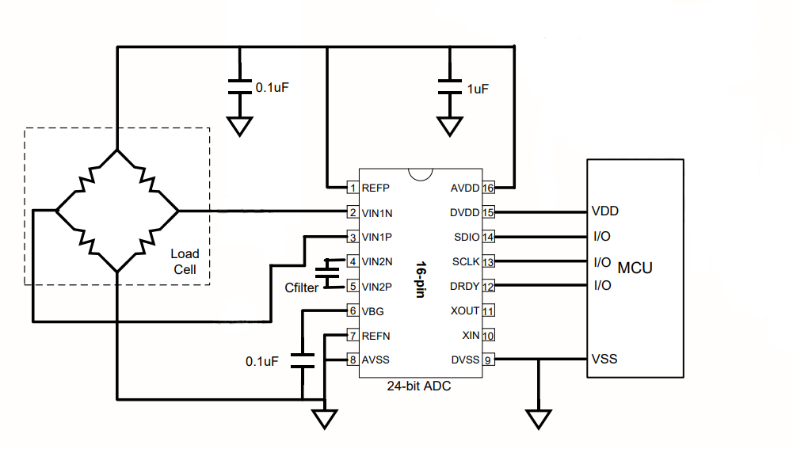

# Digital-Scale
Arduino code for a digital scale using the NAU 7802 ADC

## Pictures/Diagrams
Note: The final scale enclosure is not pictured
#### Sample Output:

#### Diagrams:

#### Calibration:

### Steps for building and connecting the Load Cell to the NAU7802:
#### Load Cell
- A 8in x ½ in x ½ in 2024 aluminum alloy bar has two holes milled into it with  a drill press
- The centers of the holes are 0.7cm apart, and the holes toward the center of the bar length-wise and width-wise
- 2024 Alloy was chosen for its resistance against hysteresis.
- On top of the milled holes, 4, 120 Ω strain gauges are superglued on in wheatstone bridge setup
- The wires extending off of the strain gauges are soldered onto wire connection pads which are adhered to the metal bar with their own adhesives
- This area (underneath the wires from the strain gauges soldered onto the connection pads) has tape on the underside to prevent wires from touching the metal bar
- Other wires are soldered onto the other sides of the wire connection pads
#### Arduino/ADC Wiring
- The NAU7802 chip is put onto the Breadboard
- The wires coming off of the metal bar are wired into the corresponding pins in the NAU7802 and GND
- Then the pins from the NAU7802 chip are wired to 5V, GND, and the Arduino in pins A5 and A4
- A 0.1uF capacitor is wired to the NAU7802
- Then LEDs and resistors were put together on the breadboard with the 220 Ω resistors and wired to the Arduino output pins. These serve as a physical indicator of the mass.
- Then the 5v and ground in the Arduino were connected to the breadboard with wires

#### Wiring Schematic

